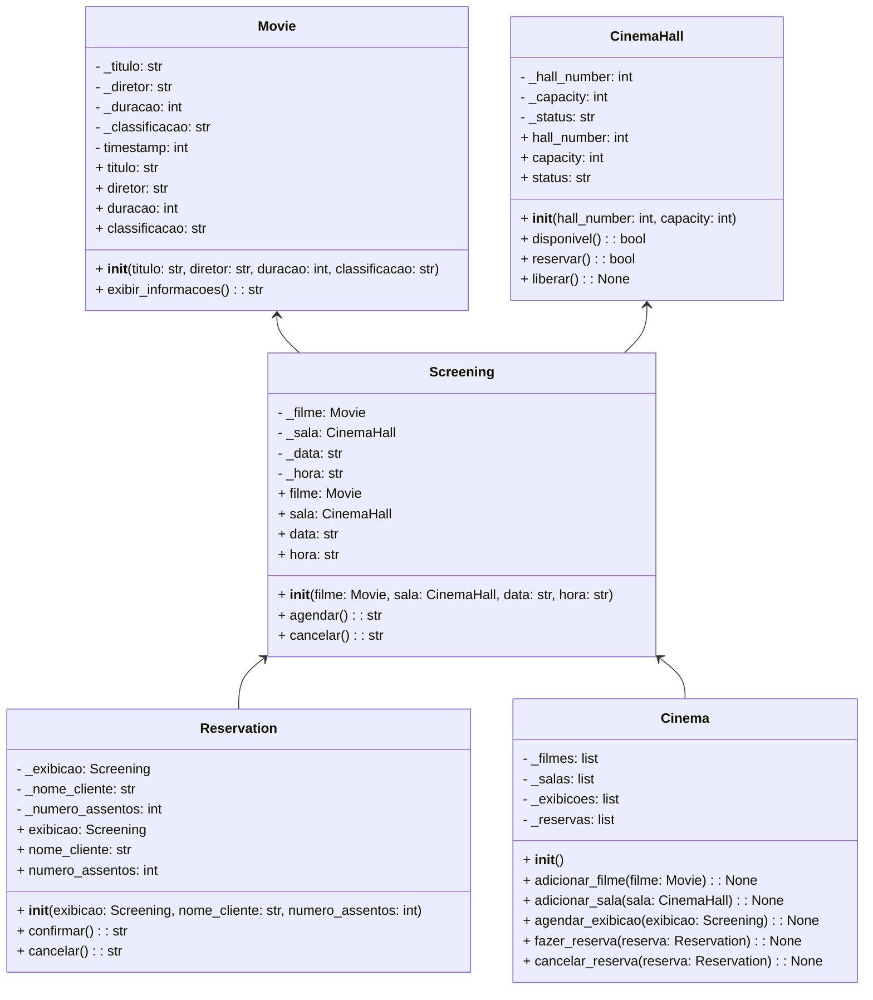

```mermaid
classDiagram
    class Movie {
        - _titulo: str
        - _diretor: str
        - _duracao: int
        - _classificacao: str
        - timestamp: int
        
        + __init__(titulo: str, diretor: str, duracao: int, classificacao: str)
        + titulo: str
        + diretor: str
        + duracao: int
        + classificacao: str
        + exibir_informacoes(): str
    }

    class CinemaHall {
        - _hall_number: int
        - _capacity: int
        - _status: str
        
        + __init__(hall_number: int, capacity: int)
        + hall_number: int
        + capacity: int
        + status: str
        + disponivel(): bool
        + reservar(): bool
        + liberar(): None
    }

    class Screening {
        - _filme: Movie
        - _sala: CinemaHall
        - _data: str
        - _hora: str
        
        + __init__(filme: Movie, sala: CinemaHall, data: str, hora: str)
        + filme: Movie
        + sala: CinemaHall
        + data: str
        + hora: str
        + agendar(): str
        + cancelar(): str
    }

    class Reservation {
        - _exibicao: Screening
        - _nome_cliente: str
        - _numero_assentos: int
        
        + __init__(exibicao: Screening, nome_cliente: str, numero_assentos: int)
        + exibicao: Screening
        + nome_cliente: str
        + numero_assentos: int
        + confirmar(): str
        + cancelar(): str
    }

    class Cinema {
        - _filmes: list
        - _salas: list
        - _exibicoes: list
        - _reservas: list
        
        + __init__()
        + adicionar_filme(filme: Movie): None
        + adicionar_sala(sala: CinemaHall): None
        + agendar_exibicao(exibicao: Screening): None
        + fazer_reserva(reserva: Reservation): None
        + cancelar_reserva(reserva: Reservation): None
    }

    Movie <-- Screening
    CinemaHall <-- Screening
    Screening <-- Reservation
    Screening <-- Cinema
```