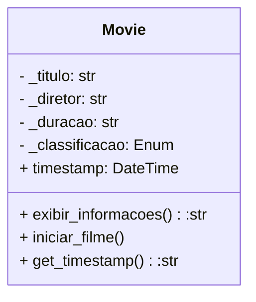

# Resolução da atividade 1

Exemplo de resolução da atividade considerando uma das classes solicitadas, incluindo métodos adicionais `get_timestamp` e `iniciar_filme` para complementar a resposta.

## Material de estudo:

**Utilizando property:**
https://realpython.com/python-property/

**Utilizando Type hint:**
https://realpython.com/python-type-checking/